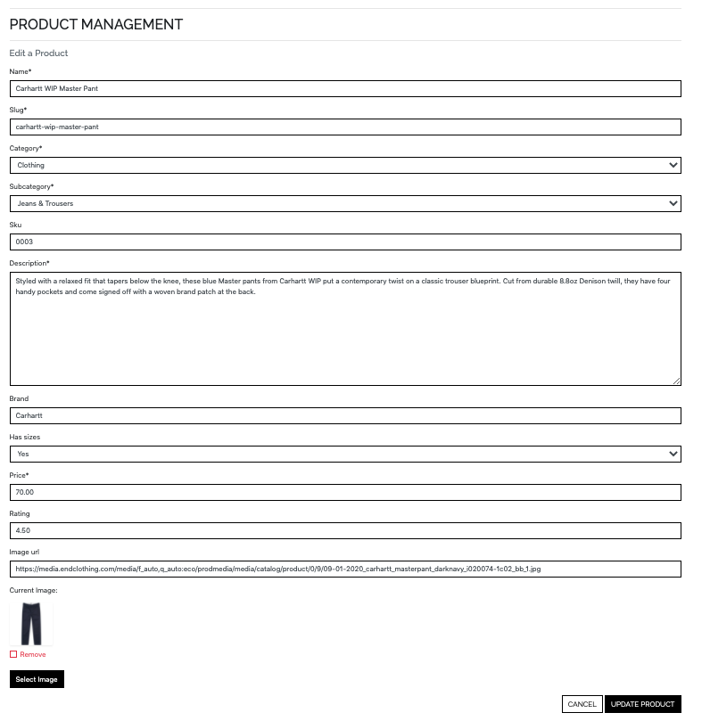

## **Site Goals**

This project is part of my [Code Institute](https://codeinstitute.net/) Full Stack Software Development Diploma, specifically for the **Full Stack Frameworks** module. The objective of this project is to "build a full-stack site based around business logic used to control a centrally-owned dataset". The site features an authentication mechanism and provides paid access to the site's data based on the dataset, such as the purchase of a product.

## **UX**

### User Stories

#### As a user, I would like to:

**Viewing and Navigation**

- [x] View a list of available products


- [x] View a specific category of products


- [x] View a specific subcategory of products


- [x] View details of an individual product, including name, price, description, rating, image and sizes if applicable


- [x] Identify sale items and special offers

- [x] Easily review the total of my purchases


**Registration and User Accounts**

- [x] Easily register an account


- [x] Easily login/logout


- [x] Easily recover my password if I lose access to my account


- [x] Receive an email confirmation on successful registration of an account

- [x] Have a personal user profile to view my order history and save my personal information


**Sorting and Searching**

- [x] Sort the list of available products by name, price, brand or rating


- [x] Sort multiple categories of products simultaneously across broad categories such as clothing or footwear


- [x] Sort products within a specific subcategory by name, price, brand or rating


- [x] Search for a product by name, description or brand

- [x] Easily see what I have searched for and the number of results


**Purchasing and Checkout**

- [x] Easily select the size and quantity of a product when purchasing


- [x] View the items in my bag


- [x] View the total cost of items in my bag

- [x] View the total shipping cost of my order


- [x] Adjust the quantity of individual items in my bag


- [x] Easily enter my payment information


- [x] Know that my personal information and payment details are secure

- [x] View an order confirmation after checkout


- [x] Receive a confirmation email after checkout


#### As an admin, I would like to:

**Admin and Store Management**

- [x] Add a product


- [x] Edit/update a product



- [x] Delete a product


Possible additions:

- [x] See which products are being viewed the most

- [x] See product sales volumes to see which products are selling best

## Features

### Consistent Site Features and Components

- All pages of the site contain the same **Header** and **Footer** components.

- **Header** 
    - The site header consists of two rows:
        - The top row contains the site logo/home link, search bar and links to the account menu and shopping bag.
        - The bottom row contains links to allow the user to navigate between the different pages of the site, depending on the type of product they are looking for.
    - If no user logged in, the Account menu will display 'Register' and 'Login' as options. 
    - If user logged in, the Account menu will display 'Profile' and 'Logout' as options.
        - Note if user is Admin/Superuser, 'Product Management' will also be featured on this menu.
    - On mobile and tablet screensizes, the nav links in the bottom row collapse into a navbar toggler/burger icon to keep the UI clean and un-cluttered and provide a positive UX.

- **Footer**
    - The footer consists of the site logo on its own row. 
    - Beneath this is a row containing:
        - A 'Contact Us' section with the company telephone number and email address (clicking the email address opens a link to write to the company in the users chosen mail app).
        - A 'Links' section, with some quick links to other areas of the site. The idea behind this was that should the scale of the site increase, it would allow the easy addition of links to terms & conditions, delivery & returns, shipping information, gift cards etc. to the footer to provide a positive UX.
        - Social Links to Leftfield Clothing social media (note that as Leftfield Clothing is for educational purposes only and therefore does not have social media, the links redirect to the specific platform home page).
    - Finally, to the bottom of the page is the site copyright information.

### All Products Page
- The **All Products Page** features an "All Products" heading and displays all the products available on the site.
- Beneath the heading is a row featuring the number of products to the left and a sort selector box to the right, allowing the user to select the parameters and direction they would like to sort products by.
- The products are displayed using Bootstrap cards and each card features:
    - An image of the product (which acts as a link to the full product description page if clicked)
    - The name of the product
    - The product brand
    - The product price
    - The product rating
    - The product subcategory (If clicked this will redirect the user to the subcategory page for that category of products)
    - If user has administator privileges, edit and delete buttons will be displayed

### Products Category Page
- The **Product Category Page** acts in a similar way to the All Products Page but features only products that belong to a specific category (eg 'All Clothing', 'All Footwear'). In addition to the sort feature, this page features a set of buttons to allow the user to easily switch between subcategories of the parent category. Clear visual cues are displayed to the user as to which subcategory they are looking at by way of a dynamic heading, displaying the current subcategory and an active page feature, inverting the colours of the current active subcategoty button.

### Product Detail Page
- The **Product Detail Page** displays all data associated with a product to the user.
- The following information is displayed for each product:
    - An image of the product (which acts as a link to open the image in a new tab)
    - The name of the product
    - The product brand
    - The product price
    - The product rating
    - The product subcategory (If clicked this will redirect the user to the subcategory page for that category of products)
    - The product description
    - A size selector for the product relevant to product category/subcategory (if applicable).
    - A quantity selector
    - If user has administator privileges, edit and delete buttons will be displayed
    - A 'Keep Shopping' button that redirects the user back to the all products page
    - An 'Add to Bag' button that will add the item to the session users bag and launch a Bootstrap Toast to notify the user that the item has successfully been added to their bag
        - The success toast features The dethails of the product added to bag, the number of items in the bag, the product image, name, size and quantity, the total cost of the bag and the amount needed to qualify for free shipping and a button to take the user to the checkout

### Shopping Bag Page

- The **Shopping Bag Page** features a 'Shopping Bag' heading and all details of items currrently in the shopping bag:
    - The product image
    - The product name, size and sku
    - The product price
    - A quantity selector
    - Update button to updaqte the quantity
    - Remove button to remove the product from the bag
    - The bag total
    - The delivery cost if applicable
    - The grand total
    - The amount needed to qualify for free shipping if total is less than the free delivery threshold
    - A 'Keep Shopping' button that redirects the user back to the all products page
    - A 'Secure Checkout' button to take the user to the checkout page
    - To maintain a positive UX, these items are stacked on mobile and tablet and displyed in columns on a desktop and stacked on mobile and tablet


### Checkout Page

- The **Checkout Page** features a 'Checkout' heading with and order summary section and a checkout form.
- On mobile and tablet, the order summary section and a checkout form are stacked, on desktops they are displayed in 2 columns, side by side.
- The order summary provides a brief summary of the items in the order and the total cost of the order.
- The checkout form has three sections:
    - Details, for the users name and emiail
    - Delivery, for the users delivery details
    - Payment, for the users paymernt details (handled by Stripe)
- The form is validated on submission and any errors are reported back to the user
-Buttons at the bottom of the page allow users to complete their order or return to thier bag.

### Profile Page
(only available to logged in users)

- The profile page features a '```<User>```'s Profile' heading, the users default delivey information and order history.
- The users default delivery information consists of a form which allows users to update and save thier delivery information. If the user opted to save their delivery information at checkout, this form will be prefilled withh the information provided at checkout.
- The order history provides a biref look at the users past orders in chronological order. If the user clicks the order number they are redirected to a complete summary of that order.

### Product Management Page
(only available to site admin/superusers)

- The product management page features a 'Product Management' heading and allows the site owner to add products to, or edit existing products in the DB.
- The page features an add product form containing all relevant fields to add a product to the DB and buttons to either cancel or add the product to the DB at the bottom of the page.
- If the user is editing a product, the form will be pre-filled with the product information and the button at the bottom of the page will read "Update Product'.

## Technologies Used

### Languages Used

* HTML
* CSS
* JavaScript
* Python

### Frameworks & Libraries and Tools Used

* [Gitpod](https://gitpod.io/) - **Gitpod** was used for the IDE while building the website.
* [Git](https://git-scm.com/) - **Git** was used for version control by utilizing the Gitpod terminal to commit to Git and Push to GitHub.
* [GitHub](https://github.com/) - **GitHub** is used to store the projects code after being pushed from Git.
* [Heroku](https://id.heroku.com/login) - **Heroku** was used as the deployment platform for this project.
* [Bootstrap 4](https://getbootstrap.com/) - **Bootstrap** was used to assist with the responsiveness and styling of the website.
* [JQuery](https://jquery.com/) - **JQuery** JavaScript library was used to simplify JavaScript code.
* [Django](https://www.djangoproject.com/) - **Django** high-level Python web framework was used to speed up and simplify the application build.
* [Stripe](https://stripe.com/en-gb) - **Stripe** was used to process online payments and webhooks.
* [AWS](https://aws.amazon.com/?nc2=h_lg) - **AWS** used for storage of static and media files using [S3](https://aws.amazon.com/s3/) and [IAM](https://aws.amazon.com/iam/) services.
* [Autopep8](https://pypi.org/project/autopep8/) - **Autopep8** used to format Python code to be PEP8 compliant.
* [Favicon.io](https://favicon.io/) - **Favicon.io** was used to create the favicon for the website.
* [Font Awesome](https://fontawesome.com/) - **Font Awesome** was used on all pages throughout the website to add icons for aesthetic and UX purposes.
* [Google Fonts](https://fonts.google.com/) - **Google Fonts** were used to import the fonts into the application to style the fonts used on all pages of the project.
* [Balsamiq](https://balsamiq.com/) - **Balsamiq** was used to create the wireframes during the design process.
* [Web Formatter](https://webformatter.com/) - **Web Formatter** was used to beautify code.
* [Am I Responsive](http://ami.responsivedesign.is/) - **Am I Responsive** was used to test page layouts during the build process.
[GMail](https://gmail.com) - **Gmail** was used to provide the SMPT server, allowing the application to handle emails.
* [PostgreSQL](https://www.postgresql.org/) - **PostgreSQL used for the relational database, hosted and deployed via Heroku.

## Testing

Detailed testing information can be found in separate [TESTING.md](https://github.com/theopmw/leftfield-clothing/blob/main/TESTING.md) file.

## Git and Version Control

This project is managed using Git version control system.

For each meaningful change made, Git is used to stage, commit and push the files to the [Recipe Box repository](https://github.com/theopmw/recipe-box) on GitHub.

For each change made, the following process was followed, a description of the different commands used throughout the project and their uses has also been provided:

* Staging:
    * When a file has been modified and it must be marked to go it to your next commit.
    * To check the status of your Git repository, including files that are not staged and files that are staged, the ```git status``` command is used.
    * To stage modified files, the ```add``` command is used, which can be run multiple times before a commit. 
        * You can either specify the specific file with ```add```. For example: "```git add my_file.html```". Or add stage all files in the current directory with "```git add .```".
        * You can also remove files from staging without losing the changes made to the file using ```reset```. For example: "```git reset my_file.html```".
* Committing:
    * Once updates have been staged, you are ready to commit them, which will record the changes made to the repository.
    * Run the ```commit``` command to commit staged files, a meaningful commit message must be included to track commits. For example: "```git commit -m "Meaningful commit message" "```.
    * You can stage and commit all tracked files with a condensed message: "```git commit -am "Meaningful commit message" "```.
    * The commit message can be modified using the ```--amend``` flag. For example: "```git commit --amend -m "New commit message""```.
* Pushing:
    * Once files have been committed and a commit message has been provided, they are pushed to the remote repository using the ```push``` command.
    * "```git push```" will transmit the local commits to the remote repository.

Git branching was also utilised to isolate the production of new features and merge them with the master branch throughout the development cycle of the project.

* Branches
    * New branches were created using ```git branch new-branch```.
    * ```git switch new-branch``` was used to switch to the new branch.
    * A feature was then worked on in the new branch and modifications were staged, committed and pushed.
    * ```git switch master``` was used to switch back to the master branch.
    * The branch was then merged with the master using ```git merge new-branch```
    * When the branch had been merged with the master and was no longer needed, ```git branch -d new-branch``` was used to delete the branch.

Parts of this section used the following article for reference: [How To Use Git: A Reference Guide](https://dev.to/digitalocean/how-to-use-git-a-reference-guide-6b6).