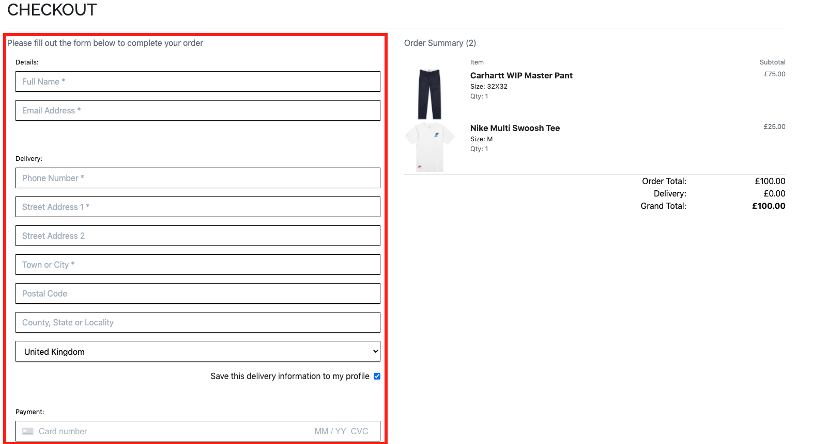
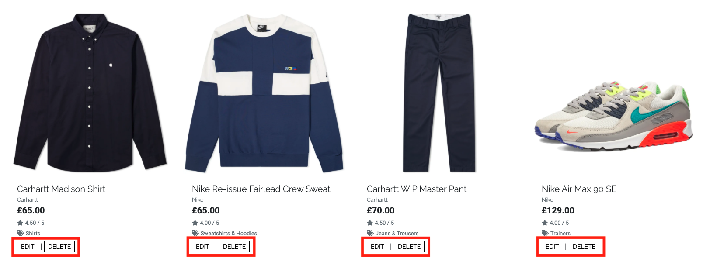

## **Site Goals**

This project is part of my [Code Institute](https://codeinstitute.net/) Full Stack Software Development Diploma, specifically for the **Full Stack Frameworks** module. The objective of this project is to "build a full-stack site based around business logic used to control a centrally-owned dataset". The site features an authentication mechanism and provides paid access to the site's data based on the dataset, such as the purchase of a product.

## **UX**

### User Stories

#### As a user, I would like to:

**Viewing and Navigation**

- [x] View a list of available products


- [x] View a specific category of products


- [x] View a specific subcategory of products


- [x] View details of an individual product, including name, price, description, rating, image and sizes if applicable


- [x] Identify sale items and special offers

- [x] Easily review the total of my purchases


**Registration and User Accounts**

- [x] Easily register an account


- [x] Easily login/logout


- [x] Easily recover my password if I lose access to my account


- [x] Receive an email confirmation on successful registration of an account

- [x] Have a personal user profile to view my order history and save my personal information


**Sorting and Searching**

- [x] Sort the list of available products by name, price, brand or rating


- [x] Sort multiple categories of products simultaneously across broad categories such as clothing or footwear


- [x] Sort products within a specific subcategory by name, price, brand or rating


- [x] Search for a product by name, description or brand

- [x] Easily see what I have searched for and the number of results


**Purchasing and Checkout**

- [x] Easily select the size and quantity of a product when purchasing


- [x] View the items in my bag


- [x] View the total cost of items in my bag

- [x] View the total shipping cost of my order


- [x] Adjust the quantity of individual items in my bag


- [x] Easily enter my payment information



- [x] Know that my personal information and payment details are secure

- [x] View an order confirmation after checkout


- [x] Receive a confirmation email after checkout


#### As an admin, I would like to:

**Admin and Store Management**

- [x] Add a product


- [x] Edit/update a product


- [x] Delete a product




Possible additions:

- [x] See which products are being viewed the most

- [x] See product sales volumes to see which products are selling best

## Features

### Consistent Site Features and Components

- All pages of the site contain the same **Header** and **Footer** components.

- **Header** 
    - The site header consists of two rows:
        - The top row contains the site logo/home link, search bar and links to the account menu and shopping bag.
        - The bottom row contains links to allow the user to navigate between the different pages of the site, depending on the type of product they are looking for.
    - If no user logged in, the Account menu will display 'Register' and 'Login' as options. 
    - If user logged in, the Account menu will display 'Profile' and 'Logout' as options.
        - Note if user is Admin/Superuser, 'Product Management' will also be featured on this menu.
    - On mobile and tablet screensizes, the nav links in the bottom row collapse into a navbar toggler/burger icon to keep the UI clean and un-cluttered and provide a positive UX.

- **Footer**
    - The footer consists of the site logo on its own row. 
    - Beneath this is a row containing:
        - A 'Contact Us' section with the company telephone number and email address (clicking the email address opens a link to write to the company in the users chosen mail app).
        - A 'Links' section, with some quick links to other areas of the site. The idea behind this was that should the scale of the site increase, it would allow the easy addition of links to terms & conditions, delivery & returns, shipping information, gift cards etc. to the footer to provide a positive UX.
        - Social Links to Leftfield Clothing social media (note that as Leftfield Clothing is for educational purposes only and therefore does not have social media, the links redirect to the specific platform home page).
    - Finally, to the bottom of the page is the site copyright information.

### All Products Page
- The **All Products Page** features an "All Products" heading and displays all the products available on the site.
- Beneath the heading is a row featuring the number of products to the left and a sort selector box to the right, allowing the user to select the parameters and direction they would like to sort products by.
- The products are displayed using Bootstrap cards and each card features:
    - An image of the product (which acts as a link to the full product description page if clicked)
    - The name of the product
    - The product brand
    - The product price
    - The product rating
    - The product subcategory (If clicked this will redirect the user to the subcategory page for that category of products)
    - If user has administator privileges, edit and delete buttons will be displayed

### Products Category Page
- The **Product Category Page** acts in a similar way to the All Products Page but features only products that belong to a specific category (eg 'All Clothing', 'All Footwear'). In addition to the sort feature, this page features a set of buttons to allow the user to easily switch between subcategories of the parent category. Clear visual cues are displayed to the user as to which subcategory they are looking at by way of a dynamic heading, displaying the current subcategory and an active page feature, inverting the colours of the current active subcategoty button.

### Product Detail Page
- The **Product Detail Page** displays all data associated with a product to the user.
- The following information is displayed for each product:
    - An image of the product (which acts as a link to open the image in a new tab)
    - The name of the product
    - The product brand
    - The product price
    - The product rating
    - The product subcategory (If clicked this will redirect the user to the subcategory page for that category of products)
    - The product description
    - A size selector for the product relevant to product category/subcategory (if applicable).
    - A quantity selector
    - If user has administator privileges, edit and delete buttons will be displayed
    - A 'Keep Shopping' button that redirects the user back to the all products page
    - An 'Add to Bag' button that will add the item to the session users bag and launch a Bootstrap Toast to notify the user that the item has successfully been added to their bag
        - The success toast features The dethails of the product added to bag, the number of items in the bag, the product image, name, size and quantity, the total cost of the bag and the amount needed to qualify for free shipping and a button to take the user to the checkout

### Shopping Bag Page

- The **Shopping Bag Page** features a 'Shopping Bag' heading and all details of items currrently in the shopping bag:
    - The product image
    - The product name, size and sku
    - The product price
    - A quantity selector
    - Update button to updaqte the quantity
    - Remove button to remove the product from the bag
    - The bag total
    - The delivery cost if applicable
    - The grand total
    - The amount needed to qualify for free shipping if total is less than the free delivery threshold
    - A 'Keep Shopping' button that redirects the user back to the all products page
    - A 'Secure Checkout' button to take the user to the checkout page
    - To maintain a positive UX, these items are stacked on mobile and tablet and displyed in columns on a desktop and stacked on mobile and tablet


### Checkout Page

- The **Checkout Page** features a 'Checkout' heading with and order summary section and a checkout form.
- On mobile and tablet, the order summary section and a checkout form are stacked, on desktops they are displayed in 2 columns, side by side.
- The order summary provides a brief summary of the items in the order and the total cost of the order.
- The checkout form has three sections:
    - Details, for the users name and emiail
    - Delivery, for the users delivery details
    - Payment, for the users paymernt details (handled by Stripe)
- The form is validated on submission and any errors are reported back to the user
-Buttons at the bottom of the page allow users to complete their order or return to thier bag.

### Profile Page
(only available to logged in users)

- The **Profile Page** features a '```<User>```'s Profile' heading, the users default delivey information and order history.
- The users default delivery information consists of a form which allows users to update and save thier delivery information. If the user opted to save their delivery information at checkout, this form will be prefilled withh the information provided at checkout.
- The order history provides a biref look at the users past orders in chronological order. If the user clicks the order number they are redirected to a complete summary of that order.

### Product Management Page
(only available to site admin/superusers)

- The **Product Management** page features a 'Product Management' heading and allows the site owner to add products to, or edit existing products in the DB.
- The page features an add product form containing all relevant fields to add a product to the DB and buttons to either cancel or add the product to the DB at the bottom of the page.
- If the user is editing a product, the form will be pre-filled with the product information and the button at the bottom of the page will read "Update Product'.

## Technologies Used

### Languages Used

* HTML
* CSS
* JavaScript
* Python

### Frameworks & Libraries and Tools Used

* [Gitpod](https://gitpod.io/) - **Gitpod** was used for the IDE while building the website.
* [Git](https://git-scm.com/) - **Git** was used for version control by utilizing the Gitpod terminal to commit to Git and Push to GitHub.
* [GitHub](https://github.com/) - **GitHub** is used to store the projects code after being pushed from Git.
* [Heroku](https://id.heroku.com/login) - **Heroku** was used as the deployment platform for this project.
* [Bootstrap 4](https://getbootstrap.com/) - **Bootstrap** was used to assist with the responsiveness and styling of the website.
* [JQuery](https://jquery.com/) - **JQuery** JavaScript library was used to simplify JavaScript code.
* [Django](https://www.djangoproject.com/) - **Django** high-level Python web framework was used to speed up and simplify the application build.
* [Stripe](https://stripe.com/en-gb) - **Stripe** was used to process online payments and webhooks.
* [AWS](https://aws.amazon.com/?nc2=h_lg) - **AWS** used for storage of static and media files using [S3](https://aws.amazon.com/s3/) and [IAM](https://aws.amazon.com/iam/) services.
* [Autopep8](https://pypi.org/project/autopep8/) - **Autopep8** used to format Python code to be PEP8 compliant.
* [Favicon.io](https://favicon.io/) - **Favicon.io** was used to create the favicon for the website.
* [Font Awesome](https://fontawesome.com/) - **Font Awesome** was used on all pages throughout the website to add icons for aesthetic and UX purposes.
* [Google Fonts](https://fonts.google.com/) - **Google Fonts** were used to import the fonts into the application to style the fonts used on all pages of the project.
* [Balsamiq](https://balsamiq.com/) - **Balsamiq** was used to create the wireframes during the design process.
* [Web Formatter](https://webformatter.com/) - **Web Formatter** was used to beautify code.
* [Am I Responsive](http://ami.responsivedesign.is/) - **Am I Responsive** was used to test page layouts during the build process.
[GMail](https://gmail.com) - **Gmail** was used to provide the SMPT server, allowing the application to handle emails.
* [PostgreSQL](https://www.postgresql.org/) - **PostgreSQL used for the relational database, hosted and deployed via Heroku.

## Testing

Detailed testing information can be found in separate [TESTING.md](https://github.com/theopmw/leftfield-clothing/blob/main/TESTING.md) file.

## Git and Version Control

This project is managed using Git version control system.

For each meaningful change made, Git is used to stage, commit and push the files to the [Recipe Box repository](https://github.com/theopmw/recipe-box) on GitHub.

For each change made, the following process was followed, a description of the different commands used throughout the project and their uses has also been provided:

* Staging:
    * When a file has been modified and it must be marked to go it to your next commit.
    * To check the status of your Git repository, including files that are not staged and files that are staged, the ```git status``` command is used.
    * To stage modified files, the ```add``` command is used, which can be run multiple times before a commit. 
        * You can either specify the specific file with ```add```. For example: "```git add my_file.html```". Or add stage all files in the current directory with "```git add .```".
        * You can also remove files from staging without losing the changes made to the file using ```reset```. For example: "```git reset my_file.html```".
* Committing:
    * Once updates have been staged, you are ready to commit them, which will record the changes made to the repository.
    * Run the ```commit``` command to commit staged files, a meaningful commit message must be included to track commits. For example: "```git commit -m "Meaningful commit message" "```.
    * You can stage and commit all tracked files with a condensed message: "```git commit -am "Meaningful commit message" "```.
    * The commit message can be modified using the ```--amend``` flag. For example: "```git commit --amend -m "New commit message""```.
* Pushing:
    * Once files have been committed and a commit message has been provided, they are pushed to the remote repository using the ```push``` command.
    * "```git push```" will transmit the local commits to the remote repository.

Git branching was also utilised to isolate the production of new features and merge them with the master branch throughout the development cycle of the project.

* Branches
    * New branches were created using ```git branch new-branch```.
    * ```git switch new-branch``` was used to switch to the new branch.
    * A feature was then worked on in the new branch and modifications were staged, committed and pushed.
    * ```git switch master``` was used to switch back to the master branch.
    * The branch was then merged with the master using ```git merge new-branch```
    * When the branch had been merged with the master and was no longer needed, ```git branch -d new-branch``` was used to delete the branch.

Parts of this section used the following article for reference: [How To Use Git: A Reference Guide](https://dev.to/digitalocean/how-to-use-git-a-reference-guide-6b6).

## Deployment

For the deployment process below, accounts for the following services must be set up:

- [GitHub](https://github.com/)
- [Heroku](https://www.heroku.com/home)
- [Stripe](https://stripe.com/en-gb)
- [Amazon Web Services (AWS)](https://aws.amazon.com/?nc2=h_lg)
- [Gmail](https://mail.google.com/)

### Heroku

Heroku was used as the deployment platform for this site using the following steps:

#### Create the App:

1. From the dashboard, select 'Create New App'. Give the app a name and select the region closest to you.

2. Provision a new Postgres database for the app by searching "Heroku Postgres" in the 'Resources' tab and adding it to the app.


3. In the IDE install the following dependencies in the CLI/terminal to allow the use of Postgres:
```
pip3 install dj_database_url
pip3 install psycopg2-binary
```

4. Freeze these requirements using the following command in the CLI/terminal:
```
pip3 freeze > requirements.txt
```

5. Create a superuser from the CLI/terminal to allow access to the Django admin panel, using the following command:
```
python3 manage.py createsuperuser
```
6. Follow the steps in the CLI/terminal to create a superuser for the app.

#### Enable the Postgres Database:

1. To set up the new database, in the project level settings.py file, import dj_database_url.

2. In the 'Settings' tab of the Heroku app, click “Reveal Config Vars” and copy the DATABASE_URL value.

3. In the DATABASES setting of the project level settings.py file, comment out the default configuration and replace the default database with a call to ```dj_database_url.parse()```:
```
# DATABASES = {
#    'default': {
#        'ENGINE': 'django.db.backends.sqlite3',
#        'NAME': BASE_DIR / 'db.sqlite3',
#    }
# }

DATABASES = {
	'default': dj_database_url.parse('postgres://...')
}
```

#### Migrating data

1. Migrate data to Postgres using the following commands in the CLI/terminal:
```
python3 manage.py showmigrations
python3 manage.py migrate
```
2. If fixtures were used, this data can be imported using the ```python3 manage.py loaddata <fixture-name>``` command in the CLI/terminal.

#### SQLite/Postgres Database Configuration

1. In settings.py create an if statement to set Postges as the database when the app is running on Heroku:
```
if 'DATABASE_URL' in os.environ:
    DATABASES = {
        'default': dj_database_url.parse(os.environ.get('DATABASE_URL'))
    }
else:
    DATABASES = {
        'default': {
            'ENGINE': 'django.db.backends.sqlite3',
            'NAME': BASE_DIR / 'db.sqlite3',
        }
    }
```
2. Install gunicorn via the CLI/terminal to act as the webserver:
```
pip3 install gunicorn
```
3. Freeze it to the requirements file:
```
pip3 freeze > requirements.txt
```
#### Create web dyno to run gunicorn and serve the app

1. Create a Procfile at system level and add the following code snippet to create the web dyno to run unicorn and serve our django app:
```
web: gunicorn <app_name>.wsgi:application
```
#### Log in to Heroku Via the CLI/terminal and Disable Static File Colloection

1. Via the CLI/terminal, log into Heroku using the following command:

```
heroku login -i
```
2. Disable stsic file collection via the CLI/terminal using the following command:

```
heroku config:set DISABLE_COLLECTSTATIC=1 --app <app_name>
```
#### Configure Heroku to Host the Live Site

1. Add the host name of the Heroku app To ALLOWED_HOSTS in the project level settings.py file (note: keep localhost there to allow the development enviroment):
```
ALLOWED_HOSTS = ['<app_name>.herokuapp.com', 'localhost']
```
2. Add, commit and push to GitHub (note: app will be deployed without static files, these will be added in a later step).

#### Enable Automatic Deployment to Heroku

1. Open the 'Deploy' tab in the Heroku dashboard and select GitHub from the 'Deployment Method' section.

2. Search for the repository and select it.

3. Click 'Connect'.

3. Click 'Enable Automatic Deploys'.

#### Set Secret Key Variables

1. Generate a secret key.

2. Navigate to the 'Settings' tab from the Heroku dashboard, click 'Reveal Config Vars' and add a new variable SECRET_KEY with the value set as the secret key generated in the previous step.

3. In the GitPod settings menu, select the 'Variables' tab and repeat the above steps but generate a new secret key value.

4. In the project level settings.py file, replace the SECRET_KEY value with a call to get the key form the environment, using an empty string as the default:
```
SECRET_KEY = os.environ.get('SECRET_KEY', '')
```
#### Set Debug

1. In the project level sattings.py file, set debug to True only if there's a DEVELOPMENT variable in the environment:
```
DEBUG = 'DEVELOPMENT' in os.environ
```
#### Commit

1. Add, commit and push files.

### Static and Media File Storage with AWS S3

#### Create a Bucket for the app in AWS S3

1. Sign into your AWS account as a root user.

2. Navigate to S3 and click 'Create Bucket' - this will be used to store all static and media files.

3. Name the bucket (note: best practice is to do this to match the name of the Heroku app).

4. Select the region closest to you from the dropdown menu.

5. Uncheck 'Block All Public Access' and confirm you acknowlege the bucket will be public by checking the checkbox below (note: this is nbeeded to allow users access to our static and media files).

6. Click 'Create Bucket'.

7. Click the new bucket to open it.

#### Setting Bucket Properties

1. Select the ''Properties' tab and enable static web hosting.

2. Input the default values (shown in the text input) for "Index document" and "Error document".

3. Click 'Save'.

#### Setting Bucket Permissions

1. Add a Cross-origin resource sharing (CORS) configuration by navigating to that section of the Permissions page to set up the required access between the Heroku app and the S3 Bucket:
```
[
  {
      "AllowedHeaders": [
          "Authorization"
      ],
      "AllowedMethods": [
          "GET"
      ],
      "AllowedOrigins": [
          "*"
      ],
      "ExposeHeaders": []
  }
]
```
2. Click 'Save'.

3. Navigate to the 'Bucket Policy' section and select 'Generate Policy' to set up a security policy for the S3 Bucket.

3. For Step 1: Select Bucket Policy, select 'S3 Bucket Policy'.

4. For Step 2: Add Statements, allow all Principals by adding an asterisk (*) to the Principal text input box, select GetObject from the Actions dropdown and copy the Amazon Resource Name (ARN) from the 'Properties' tab into the ARN text input box.

5. Click 'Add Statement'.

6. Click 'Generate Policy'.

7. Copy the policy and paste it into the Bucket Policy Editor.

8. To allow access to all resources in the bucket, add a slash and asterisk (/*) to the end of the Resource key.
```
"Resource": "arn:aws:s3:::.../*",
```
9. Click 'Save'.

10. Navigate to the Access control list (ACL) section and check the Everyone (public access) Grantee objects list checkbox.

11. Accept that you acknowledge the S3 Bucket will have public access.

12. Click 'Save Changes'

### AWS Identity and Access Management with AWS IAM

- Create AWS Groups, Policies and Users to access static and media files

#### Creating a Group

1. Open IAM from the AWS 'Services' menu.

2. Click 'Groups from the IAM Dashboad and click 'Create New Group'.

3. Give the group a name, for example ```manage-<app-name>``` (note: user groups manage permissions, so name it accordingly).

4. Click 'Create Group'.

#### Create the Policy

1. Select 'Policies' from the IAM dashboard and click 'Create Policy'.

2. Click the 'JSON' tab and click 'Import managed policy' at the top right of the editor.

3. Select the 'AmazonS3FullAccess' policy and click 'Import'.

4.For the purpose of this project, access is only required from this bucket, so change the '```Resource:```' key in the JSON file to the following using the bucket ARN (note: ARN found on the 'Permissions' tab of the S3 Bucket):
```
"Resource": [
            "arn:aws:s3:::...",
            "arn:aws:s3:::.../*"
            ]
```

5. Click through and give the policy a name, for example '```<app-name>-policy```' and a description.

6. Click 'Create Policy'.

#### Attach Policy to the Group

1. Navigate to the 'Groups' tab in the IAM dashboard.

2. Select the relevant group.

3. Click 'Attach Policy'.

4. Select the required policy and click 'Add Policy'

#### Create User for the Group

1. Navigate to the 'Users' tab in the IAM dashboard.

2. Click 'Add User'.

3. Give the user a name, for example '```<app-name>-staticfiles-user```'.

4. Select the 'Programatic Access' checkbox.

5. Click 'Next: Permissions'.

6. Select the group to add the user to and click through to the end and click 'Create User'.

7. Click 'Download .csv' to download the attached csv file **(note: very important to download and save this as because once this process is complete it cannot be downloaded again).**

### Connect Django to S3

#### Install Packages

1. In the IDE, install boto-3 and django-storages in the CLI/terminal using the following commands:
```
pip3 install boto3
pip3 install django-storages
```

2. Freeze the requirements using command:
```
pip3 freeze > requirements.txt
```

3. In the project level settings.py file, add ```'storages'``` to the list of ```INSTALLED_APPS```.

#### Add Settings in settings.py to Connect the Heroku App to S3

1. Add if statement to connect to S3 if ```USE_AWS``` variable is in the environment:
```
if 'USE_AWS' in os.environ:
    # Bucket Config
    AWS_STORAGE_BUCKET_NAME = '<bucket-name>'
    AWS_S3_REGION_NAME = '<bucket-region>'
    AWS_ACCESS_KEY_ID = os.environ.get('AWS_ACCESS_KEY_ID')
    AWS_SECRET_ACCESS_KEY = os.environ.get('AWS_SECRET_ACCESS_KEY')
```

### Add AWS Keys to Heroku Config Variables

1. Navigate to the 'Settings tab in the Heroku dashboard and click 'Reveal Config Vars'.

2. Create two new Config Variables ```AWS_ACCESS_KEY_ID``` and ```AWS_SECRET_ACCESS_KEY``` and set them to the values found in the relevant fields from the AWS 'new_user_credentials.csv' file downloaded previously.

3. Add ```USE_AWS``` to the Heroku Config Vars and set its value to True.

4. Remove the DISABLE_COLLECTSTATIC variable so that when deploying to Heroku, Django will collect static and media files automatically and upload them to S3.

### Tell Django Where Static Files Will Come From in Production 

1. In the project level settings.py file, add a further variable, ```AWS_S3_CUSTOM_DOMAIN```, to the ```if 'USE_AWS' in os.environ:``` statement:
```
if 'USE_AWS' in os.environ:
    # Bucket Config
    AWS_STORAGE_BUCKET_NAME = '<bucket-name>'
    AWS_S3_REGION_NAME = '<bucket-region>'
    AWS_ACCESS_KEY_ID = os.environ.get('AWS_ACCESS_KEY_ID')
    AWS_SECRET_ACCESS_KEY = os.environ.get('AWS_SECRET_ACCESS_KEY')
    AWS_S3_CUSTOM_DOMAIN = f'{AWS_STORAGE_BUCKET_NAME}.s3.amazonaws.com'
```

2. At the system level, create a new file called custom_storages.py and import the following into the new file:
```
from django.conf import settings
from storages.backends.s3boto3 import S3Boto3Storage
```

3. Within the custom_storages.py file, create the following classes to set the location for static and media files:

```
class StaticStorage(S3Boto3Storage):
    location = settings.STATICFILES_LOCATION


class MediaStorage(S3Boto3Storage):
    location = settings.MEDIAFILES_LOCATION
```

4. In the project level settings.py file, add the following to the ```if 'USE_AWS' in os.environ:``` statement to tell Django to use the storage classes created above for file storage and the location to save the static and media files to:
```
    # Static and media files
    STATICFILES_STORAGE = 'custom_storages.StaticStorage'
    STATICFILES_LOCATION = 'static'
    DEFAULT_FILE_STORAGE = 'custom_storages.MediaStorage'
    MEDIAFILES_LOCATION = 'media'
```

5. Override and explicitly set the URLs for static and media files using the custom domain and the new locations in the same ```if 'USE_AWS' in os.environ:``` statement:
```
    # Override static and media URLs in production
    STATIC_URL = f'https://{AWS_S3_CUSTOM_DOMAIN}/{STATICFILES_LOCATION}/'
    MEDIA_URL = f'https://{AWS_S3_CUSTOM_DOMAIN}/{MEDIAFILES_LOCATION}/'
```

### Caching, Media Files & Admin

#### Caching

1. As static files are unlikely to change often due to the scope of this project, they can be cached for a long time. To do this, an ```AWS_S3_OBJECT_PARAMETERS``` dictionary can be added to the same ```if 'USE_AWS' in os.environ:``` statement as above:
```
    # Cache control
    AWS_S3_OBJECT_PARAMETERS = {
        'Expires': 'Thu, 31 Dec 2099 20:00:00 GMT',
        'CacheControl': 'max-age=94608000',
    }
```

#### Add Media Files to S3

1. Navigate to the app S3 Bucket on the S3 website.

2. In the objects tab, create a new folder called 'media' and click 'Save'.

3. Open the folder and click 'Upload' then click 'Add Files'.

4. Select the files to upload and click 'Next'.

5. Under 'Permissions' and 'Predefined ACLs', select 'Grant public-read access'
and click 'Upload'.

#### Confirm Email for Superuser on Postgres Database

1. Navigate to the live Heroku app and access the admin panel via '```<app-name>.herokuapp.com/admin```'.

2. In the Emails tab, click the user email and select both 'Verified' and 'Primary' from the options.

3. Click 'Save'.

### Stripe 

#### Stripe Public and Secret Keys

1. Log in to Stripe.

2. Navigate to the 'API keys' tab within the 'Developers' dashboard.

3. Copy the Publishable Key and Secret Key, 

4. Navigate to the 'Config Vars' section within the Heroku app 'Settings' tab and add them as variables (```STRIPE_PUBLIC_KEY``` & ```STRIPE_SECRET_KEY```).

NOTE - These varabales must match the varibales in the project level settings.py file.

#### Stripe Webhooks

1. Navigate to the Stripe 'Developers' dashboard and select 'Webhooks' from the menu.

2. Click the '+ Add Endpoint' button in the top right.

3. Add the URL for the Heroku app to the 'Endpoint URL' textbox, adding ```checkout/wh/``` to the end of the URL. For example:
```https://app-name.herokuapp.com/checkout/wh/```

4. Select events to send from the 'Events To Send' select box (note: for the purpose of this project these are: ```payment_intent.succeeded``` & ```payment_intent.payment_failed```).

5. At the top of the page, click 'Reveal' under the 'Signing secret' tab. Copy this and add it to the Heroku 'Config Vars' (```STRIPE_WH_SECRET```).

NOTE - These varabales must match the varibales in the project level settings.py file.

6. To test, send a test webhook from the Stripe Webhook panel and check the logged response.

### Setting up Django to Send Emails

Gmail was used for the email provider for this site.

1. Log into Gmail.

2. Navigate to Gmail settings in upper right of the screen.

3. Navigate to the 'Accounts and Import' tab and select 'Other Google Account Settings'.

4. Select the 'Security' tab and under the 'Signing in to Google' section, select '2-Step Varification'.

5. Click the 'Get Statrted' button and enter your password.

6. Select a varification method/

7. When prompted, enter the varification code and click 'Turn On'.

8. Return to the 'Signing in to Google' section and click 'App Passwords'.

9. Under 'Select App', select 'Mail', under 'Select Device' select 'Other' and name it Django.

10. Click 'Generate'.

11. A Modal will pop up with a 'Generated app password'. Copy this and click 'Done'.

12. Return to the Heroku app settings and enter this code as a Config Variable with Key set as ```EMAIL_HOST_PASS```.

13. Add another variable to the Heroku Config Vars with Key set as ```EMAIL_HOST_USER``` and set the Value to the Gmail account.

14. Return to the project level settings.py file and add the following settings:
```
if 'DEVELOPMENT' in os.environ:
    EMAIL_BACKEND = 'django.core.mail.backends.console.EmailBackend'
    DEFAULT_FROM_EMAIL = 'site-name@example.com'
else:
    EMAIL_BACKEND = 'django.core.mail.backends.smtp.EmailBackend'
    EMAIL_USE_TLS = True
    EMAIL_PORT = 587
    EMAIL_HOST = 'smtp.gmail.com'
    EMAIL_HOST_USER = os.environ.get('EMAIL_HOST_USER')
    EMAIL_HOST_PASSWORD = os.environ.get('EMAIL_HOST_PASS')
    DEFAULT_FROM_EMAIL = os.environ.get('EMAIL_HOST_USER')
```

15. Navigate to the live site admin panel. Click 'Sites' and fill out the "Domain name" and "Display name" as appropirate (the name of the site).

### Forking the GitHub Repository

By forking the GitHub Repository we make a copy of the original repository on our GitHub account to view and/or make changes without affecting the original repository by using the following steps:

1. Log in to GitHub and locate the [GitHub Repository](https://github.com/theopmw/leftfield-clothing)
2. At the top of the Repository (not top of page) just above the "Settings" Button on the menu, locate the "Fork" Button.
3. You should now have a copy of the original repository in your GitHub account.

### Making a Local Clone

1. Log in to GitHub and locate the [GitHub Repository](https://github.com/theopmw/theopmw/leftfield-clothing).
2. Under the repository name, click "Clone or download".
3. To clone the repository using HTTPS, under "Clone with HTTPS", copy the link.
4. Open Git Bash.
5. Change the current working directory to the location where you want the cloned directory to be made.
6. Type "git clone", and then paste the URL you copied in Step 3:

```
$ git clone https://github.com/theopmw/theopmw/leftfield-clothing
```

7. Press Enter and your local clone will be created.