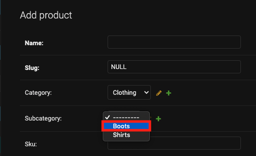
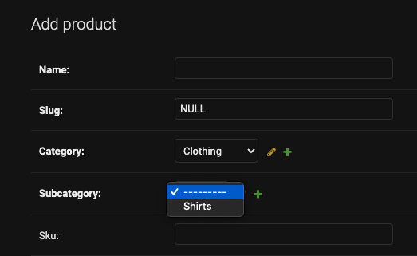
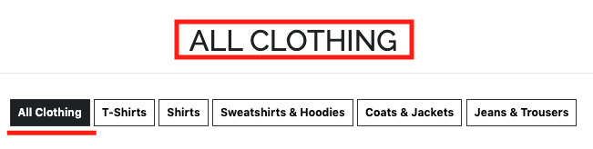
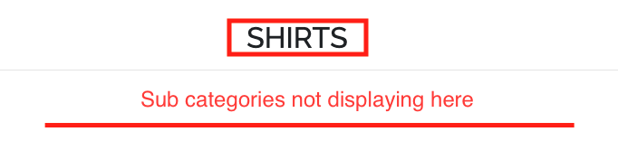
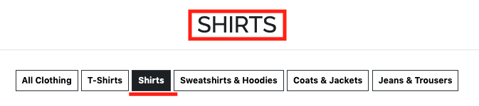
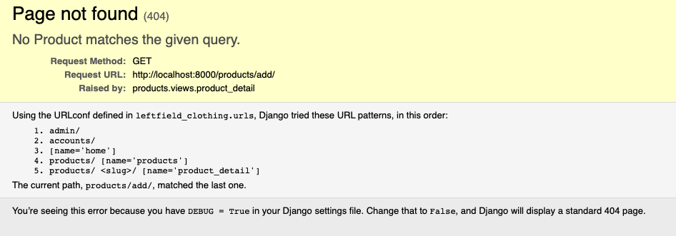
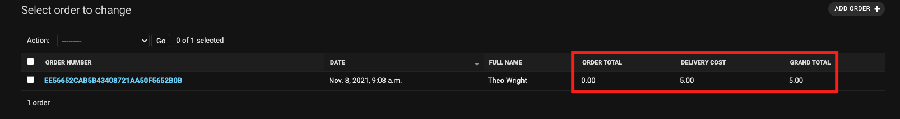

## User Stories

The user stories are annotated below to describe functionality and highlight the way in which the project fulfils the objectives set out. Relevant screenshots relating to each of the user stories below can be found in the main [README.md](https://github.com/theopmw/leftfield-clothing/blob/main/README.md) file.

### As a User I Would like to:

#### Viewing and Navigation

- **View a list of available products**

    - [x] The All Products nav menu item is clearly visible at the top of the page (or in the navbar toggler/burger menu on mobile and tablet) on all pages of the site and will redirect users to the All Products page.

- **View a specific category of products**

    - [x] The Category nav menu items are clearly visible at the top of the page (or in the navbar toggler/burger menu on mobile and tablet) on all pages of the site and will redirect users to the chosen category page.

- **View a specific subcategory of products**

    - [x] Hovering over a category in the nav menu (or clicking on mobile and tablet devices) will open the subcategory menu for each category.

    - [x] Beneath the page heading stating the category/subcategory is a list of subcategory buttons to allow the user to easily navigate between subcategories of the chosen category.

    - [x] Under each product, the subcategory is displayed as part of the product details, clicking on this will open the chosen subcategory page and display all products belonging to that subcategory.

- **View details of an individual product, including name, price, description, rating, image and sizes if applicable**

    - [x] Clicking any product image will open the specific product detail page which provides users with full details of the product, the ability to select quantities and sizes of the product and a button to add the product to their bag.

- **Easily review the total of my purchases**

    - [x] The Shopping Bag can be easily navigated to from the top navigation menu and is displayed on all pages of the site on all device sizes. The grand total is clearly displayed at the bottom of the page, following a summary of all items in the bag.

#### Registration and User Accounts

- **Easily register an account**

    - [x] When no user is in session, thye Register menu item is available in the top nav menu (on all devices).

    - [x] The form will check that the email and username are unique and not already registered in the DB. If they aren't unique, and error message will be displayed to the user to inform them that the username/email is already taken and prompt them to enter a new one.

    - [x] The form will check if both passwords match and meet the designated criteria. If they don't, an error message will notify the user and prompt them to enter a new one.

    - [x] If there are no validation errors, the account will be set up and the user will be redirected to the verify your email address page, a Bootstrap toast will notify the user that a confirmation email has been sent to their email address and once confirmed via the link in the email, they will be redirected to sign it to their new account.

    - [x] If the user is already registered, there is a link above the form to redirect them to the Sign In Page.

- **Easily login/logout**

    - [x] The Sign In Page is clearly visible on the navigation menu, when there is no user in session (on all devices).

    - [x] If the user inputs login credentials that do not match with any stored in the DB a message will be dispalyed to notify them that "The username and/or password you specified are not correct."

    - [x]  Once logged in and a registered user is in session, they will have access to the Profile link in the top navigation menu. They will be redirected to the Home Page and a Bootstrap toast will notify them they have been successfully logged in.

    - [x] If the user is does not have an account registered, there is a link above the form to redirect them to the Registration Page.

    - [x] When a registered user is in session, the Logout menu item is displayed in the top navigation menu. When clicked, the user will be redirected to the Sign Out Page and can confirm they wish to sign out. Upon successful logout the user will be redirected to the Home Page and a Bootstrap toast notifies them thay have been successfully logged out.

- **Easily recover my password if I lose access to my account**

    - [x] On the Sign In Page, there is a link to reset password beneath the form. When clicked, the user is redirected to the Password Reset Page where they can enter their email to recieve an email containing a link allowing them to reset their password.

- **Receive an email confirmation on successful registration of an account**

    - [x] On successful registration of account, the user is sent an email to the email address provided in the registration form with a link for them to confirm their email. On clicking this link, they are redirected to the Sign In page. A Bootstrap toast is displayed notifying the user of successful registration and email confirmation.

- **Have a personal user profile to view my order history and save my personal information**

    - [x] When a user is in session, the Profile page is available through the Account menu.

    - [x] The profile page displays the users default delivery information (which is saved if they check the checkbox when placing an order). They are able to update these details on the Profile page. The users order history is also displayed in chronological order. The order numbers act as links to open a confirmation with a full breakdown of the order.

### Sorting and Searching

- **Sort the list of available products by name, price, brand or rating**

    - [x] From the All Products Page, the Sort Selector Box allows the user to sort all available items in ascending and decending order by name, price, brand or rating.

- **Sort multiple subcategories of products simultaneously across broad categories such as clothing or footwear**

    - [x] From the Category Page, the Sort Selector Box allows the user to sort categories of products in ascending and decending order by name, price, brand or rating.

- **Sort products within a specific subcategory by name, price, brand or rating**

    - [x] From the Subcategory Page, the Sort Selector Box allows the user to sort subcategories of products in ascending and decending order by name, price, brand or rating.

- **Search for a product by name, description or brand**

    - [x] The search bar allows the user to search all available products by name, description or brand.

    - [x] If the user submits an empty search, a Bootstrap toast is displayed to notify them that they haven't entered any search criteria.

- **Easily see what I have searched for and the number of results**

    - [x] If the user submits a successful search, the products that meet the search criteria are displayed. At the top of the page, the number of resuts and search term are displayed for the user, along with a link to return them to the All Products Page.

#### Purchasing and Checkout

- **Easily select the size and quantity of a product when purchasing**

    - [x] On the product detail page there is a Size selector box which displays the correct size type based on the type of product, or is hidden if the product does not have sizes.

    - [x] On the product detail page there is a Quantity selctor box which allows the user to select the quantity of product (range between 1-100).

- **View the items in my bag**

    - [x] The Shopping Bag page displays all prodycts currently in the bag.

    - [x] The user is able to use the quantity selector box to update the quantity of any product in the shopping bag or remove the item entirely.

- **View the total cost of items in my bag**

    - [x] At the bottom of the Shopping Bag page, the grand total of all items is diplayed including the delivery cost if applicable.

- **View the total shipping cost of my order**

    - [x] At the bottom of the Shopping Bag page, the delivery cost is displayed to the user.

    - [x] If the order is less than the free delivery threshold (£50), the user is notified of how much more they njeed to spend to qualify for free shipping.

    - [x] If the order is greater than the free delivery threshold, the delivery cost will be displayed as £0.00.

- **Adjust the quantity of individual items in my bag**

    - [x] On the Shopping Bag page, the user can easily update or remove items in the shopping bag using the quantity selector and the update and remove buttons.

- **Easily enter my payment information**

    - [x] On the Checkout page, the user can easily enter their details to place an order.

     - [x] If the user has an account, is logged in and enters their details, they can check the checkbox to save the delivery information provided to their profile.

    - [x] If the user has an account, is logged in, and has saved thier details to their profile, the Details and Delivery section of the checkout form will be pre-filled with these saved details. If they enter new details, they can check the checkbox to save these new details to their profile.

    - [x] If there are any validation errors on the form, the user will be notified by an error message relating to the issue.

- **Know that my personal information and payment details are secure**

    - [x] As Stripe is used to handle all payments, their in-built security is applied to all payments made through the site.

- **View an order confirmation after checkout**

    - [x] Upon successful checkout, the user is redirected to a confirmation page outlining all the details of the order and is informed that a confirmation email has been sent to the email address provided in the checkout form.

- **Receive a confirmation email after checkout**

    - [x] Upon successful checkout, the user will be sent a confirmation email containing the details of the order.


### As an Admin I Would like to:

#### Admin and Store Management

Admin users have full access to **CRUD** operations - **C**reate, **R**ead, **U**pdate and **D**elete.

- **Add a product**

    - [x] When logged in as an admin/superuser, the Product Management page is available from the Account menu.

    - [x] From the Product Management page the admin can add a product to the DB by filling out the Add Product form.

    - [x] If there are any validation errors whilst filling out the form, the admin will be notified.

    - [x] On successful form submission, the admin will be redirected to the new products product page.

- **Edit/update a product**

    - [x] From the Products page or an individual Product Detail page, admin users have access to the edit product button.

    - [x] This opens up the Edit Product form. This form is pre-filled with the product details and can be edited/updated by the admin and saved to the DB.

- **Delete a product**

    - [x] From the Products page or an individual Product Detail page, admin users have access to the delete product button.

    - [x] This button will permanently delete a product from the DB.

##  Bugs

- ### Django admin: populating select options depending on another select

Expected:  
The aim was to create a data structure where each product related to a subcategory and each subcategory related to a category. When adding products in the Django admin panel the values available to select in the subcategories dropdown should only be childern of the parent category.

Testing:  
Attempt to add a product and check whether subcategory dropdown items are filtering correctly based on the parent category selected in the category dropdown.

Result:  
All subcategories were shown regardless of the selection of category.



Fix:  
To fix this the [views.py](products/views.py) file had to be adapted. The initial source that assisted the development of this feature was modified from an article from [Better Programming](https://betterprogramming.pub/optimizing-django-admin-6a1187ddbb09). In order to achieve the desired result the get sub_category view had to be modified from the original source into the following:
```
def get_subcategory(request):
    """
    View to get parent category, filter items in the subcategory field
    dropdown based on the category selected and respond with json data.
    """
    # Get category id from DB based on dropdown selection
    category = request.GET.get('id')
    print("CATEGORY: ", category)
    # Filter sucategories based on the category select box value
    result = list(SubCategory.objects.filter(
        category_id=int(category)).values('category', 'name'))
    print("GET RESULT: ", result)
    return HttpResponse(json.dumps(result), content_type="application/json")
```

The final result can be seen below, only subcategories of the clothing category are available for selection from the subcategoy dropdown when the category dropdown is set to "Clothing".


- ### Subcategory buttons only displaying on main category page

Expected  
When one of the subcategory buttons is clicked, the url for that category or subcategory is opened, and the products belonging to that category or subcategory are displayed.

Result  
The buttons were showing when the user selects the category  (eg. “All Clothing” / “All Footwear”) option from the main nav dropdown menu but weren’t once the user then clicks one of the subcategory buttons at the top of the page.

Screenshot of All Clothing page (with nav buttons displayed):



Screenshot of Shirts page (without nav buttons displayed):



Testing  
When the user clicks one of the subcategory buttons, the correct page is shown but the buttons for other subcategories were no longer displayed.

Fix  
An additional for loop had to be added to loop over the sub categories and check that the subcategories belonged to the parent category.

Screenshot of Shirts page (with nav buttons displayed):



Code snippet with both loops:

```   

    
        <a class="subcategory-badge text-decoration-none" href="?category=clothing">
            <span class="p-2 mt-2 badge badge-white text-black rounded-0 border border-dark">All Clothing</span>
        </a>
        <a class="subcategory-badge text-decoration-none" href="?subcategory=t_shirts">
            <span class="p-2 mt-2 badge badge-white text-black rounded-0 border border-dark">T-Shirts</span>
        </a>
        <a class="subcategory-badge text-decoration-none" href="?subcategory=shirts">
            <span class="p-2 mt-2 badge badge-white text-black rounded-0 border border-dark">Shirts</span>
        </a>
        <a class="subcategory-badge text-decoration-none" href="?subcategory=sweatshirts_hoodies">
            <span class="p-2 mt-2 badge badge-white text-black rounded-0 border border-dark">Sweatshirts & Hoodies</span>
        </a>
        <a class="subcategory-badge text-decoration-none" href="?subcategory=coats_jackets">
            <span class="p-2 mt-2 badge badge-white text-black rounded-0 border border-dark">Coats & Jackets</span>
        </a>
        <a class="subcategory-badge text-decoration-none" href="?subcategory=jeans_trousers">
            <span class="p-2 mt-2 badge badge-white text-black rounded-0 border border-dark">Jeans & Trousers</span>
        </a>
    
        <a class="subcategory-badge text-decoration-none" href="?catesgory=footwear">
            <span class="p-2 mt-2 badge badge-white text-black rounded-0 border border-dark">All Footwear</span>
        </a>
        <a class="subcategory-badge text-decoration-none" href="?subcategory=trainers">
            <span class="p-2 mt-2 badge badge-white text-black rounded-0 border border-dark">Trainers</span>
        </a>
        <a class="subcategory-badge text-decoration-none" href="?subcategory=boots">
            <span class="p-2 mt-2 badge badge-white text-black rounded-0 border border-dark">Boots</span>
        </a>
        <a class="subcategory-badge text-decoration-none" href="?subcategory=shoes">
            <span class="p-2 mt-2 badge badge-white text-black rounded-0 border border-dark">Shoes</span>
        </a>
    
        <a class="subcategory-badge text-decoration-none" href="?category=accessories">
            <span class="p-2 mt-2 badge badge-white text-black rounded-0 border border-dark">All Accessories</span>
        </a>
        <a class="subcategory-badge text-decoration-none" href="?subcategory=bags">
            <span class="p-2 mt-2 badge badge-white text-black rounded-0 border border-dark">Bags</span>
        </a>
        <a class="subcategory-badge text-decoration-none" href="?subcategory=hats">
            <span class="p-2 mt-2 badge badge-white text-black rounded-0 border border-dark">Hats</span>
        </a>
        <a class="subcategory-badge text-decoration-none" href="?subcategory=socks">
            <span class="p-2 mt-2 badge badge-white text-black rounded-0 border border-dark">Socks</span>
        </a>
    
        <a class="subcategory-badge text-decoration-none" href="?category=special_offers">
            <span class="p-2 mt-2 badge badge-white text-black rounded-0 border border-dark">SPECIAL OFFERS TEST BUTTON</span>
        </a>
    


    
        <a class="subcategory-badge text-decoration-none" href="?category=clothing">
            <span class="p-2 mt-2 badge badge-white text-black rounded-0 border border-dark">All Clothing</span>
        </a>
        <a class="subcategory-badge text-decoration-none" href="?subcategory=t_shirts">
            <span class="p-2 mt-2 badge badge-white text-black rounded-0 border border-dark">T-Shirts</span>
        </a>
        <a class="subcategory-badge text-decoration-none" href="?subcategory=shirts">
            <span class="p-2 mt-2 badge badge-white text-black rounded-0 border border-dark">Shirts</span>
        </a>
        <a class="subcategory-badge text-decoration-none" href="?subcategory=sweatshirts_hoodies">
            <span class="p-2 mt-2 badge badge-white text-black rounded-0 border border-dark">Sweatshirts & Hoodies</span>
        </a>
        <a class="subcategory-badge text-decoration-none" href="?subcategory=coats_jackets">
            <span class="p-2 mt-2 badge badge-white text-black rounded-0 border border-dark">Coats & Jackets</span>
        </a>
        <a class="subcategory-badge text-decoration-none" href="?subcategory=jeans_trousers">
            <span class="p-2 mt-2 badge badge-white text-black rounded-0 border border-dark">Jeans & Trousers</span>
        </a>
    
        <a class="subcategory-badge text-decoration-none" href="?category=footwear">
            <span class="p-2 mt-2 badge badge-white text-black rounded-0 border border-dark">All Footwear</span>
        </a>
        <a class="subcategory-badge text-decoration-none" href="?subcategory=trainers">
            <span class="p-2 mt-2 badge badge-white text-black rounded-0 border border-dark">Trainers</span>
        </a>
        <a class="subcategory-badge text-decoration-none" href="?subcategory=boots">
            <span class="p-2 mt-2 badge badge-white text-black rounded-0 border border-dark">Boots</span>
        </a>
        <a class="subcategory-badge text-decoration-none" href="?subcategory=shoes">
            <span class="p-2 mt-2 badge badge-white text-black rounded-0 border border-dark">Shoes</span>
        </a>
        
        <a class="subcategory-badge text-decoration-none" href="?category=accessories">
            <span class="p-2 mt-2 badge badge-white text-black rounded-0 border border-dark">All Accessories</span>
        </a>
        <a class="subcategory-badge text-decoration-none" href="?subcategory=bags">
            <span class="p-2 mt-2 badge badge-white text-black rounded-0 border border-dark">Bags</span>
        </a>
        <a class="subcategory-badge text-decoration-none" href="?subcategory=hats">
            <span class="p-2 mt-2 badge badge-white text-black rounded-0 border border-dark">Hats</span>
        </a>
        <a class="subcategory-badge text-decoration-none" href="?subcategory=socks">
            <span class="p-2 mt-2 badge badge-white text-black rounded-0 border border-dark">Socks</span>
        </a>
    
        <a class="subcategory-badge text-decoration-none" href="?category=special_offers">
            <span class="p-2 mt-2 badge badge-white text-black rounded-0 border border-dark">SPECIAL OFFERS TEST BUTTON</span>
        </a>
    
 

```

- ### Slug field as url path causing add product URL error

Expected:  
When navigating to the add product URL, the add product page is displayed.

Testing:  
Navigate to the add product page.

Result:  
A page not found (404) error is displayed.



This was caused as the product detail URL is set to a slug and the when navigating to products/add URL, add was being interpreted as a slug(string). 

Fix:  
Since a slug is a string and therefore cannot be specified as an integer, the product_id had to be added to the URL so that Django would continue past the product detail URL to retrieve the add product URL. As they are both strings, Django was interpretting the /add as a product. The URL had to be set up to take a slug and an integer as parameters, but in the view use only the integer primary key to access the product. Then the object’s get_absolute_url object inserts both slug and primary key into the URL.

Code snippet for fix:

Set up url to take a slug and integer as parameters - [products/urls.py](products/urls.py):  
```
urlpatterns = [
    path('', views.all_products, name='products'),
    path('<slug:slug>/<int:product_id>/', views.product_detail, name='product_detail'),
    path('add/', views.add_product, name='add_product'),
    ]
```

In the views use the integer primary key to access the product - [products/views.py](products/views.py):  
```
def get_redirected(queryset_or_class, lookups, validators):
    """
    Calls get_object_or_404 and conditionally builds redirect URL.
    """
    obj = get_object_or_404(queryset_or_class, **lookups)
    for key, value in validators.items():
        if value != getattr(obj, key):
            return obj, obj.get_absolute_url()
    return obj, None


def product_detail(request, slug, product_id):
    """
    View to show individual product details.
    """
    product, product_url = get_redirected(Product, {'pk': product_id}, {'slug': slug})
    if product_url:
        return redirect(product_url)

    context = {
        'product': product,
    }

    return render(request, 'products/product_detail.html', context)
```

Add get_absolute_url object to Product model - [products/models.py](products/models.py): 
```
class Product(models.Model):
    """
    Model for Product table
    """
    def get_absolute_url(self):
        return reverse('product', kwargs={'slug': self.slug, 'id':self.id})
    # Everything else in model
``` 

Update URL path in template to take product id - [products/templates/products/products.html](products/templates/products/products.html)  
```
<a href="">
    
</a>

<a href="">
    
</a>
```

##  Known bugs & issues

- ### Delivery cost remaining in admin if all line items are removed

If products are removed via the admin panel to set the order total at £0.00, the delivery cost still remains on the order in the admin.



The code that causes this is from the update_total function in the checkout app [models.py](checkout/models.py) file.

The following code snippet from [checkout/models.py](checkout/models.py) illustrates that the bug is caused by the STANDARD_DELIVERY_PRICE being applied to any order total that is below the FREE_DELIVERY_THRESHOLD, even if that total is £0.00.

```
def update_total(self):
        """
        Update grand total each time a line item is added,
        accounting for delivery costs.
        """
        self.order_total = self.lineitems.aggregate(
            Sum('lineitem_total'))['lineitem_total__sum'] or 0
        if self.order_total < settings.FREE_DELIVERY_THRESHOLD:
            self.delivery_cost = (
                settings.STANDARD_DELIVERY_PRICE)
        else:
            self.delivery_cost = 0
        self.grand_total = self.order_total + self.delivery_cost
        self.save()
```

Since the user is unable to create an order of £0.00 this should not cause eny errors or issues for the user when placing an order or allow any delivery charges to be made to the users account without making a purchase that is below the free delivery threshold (£50.00) but greater than £0.00.


